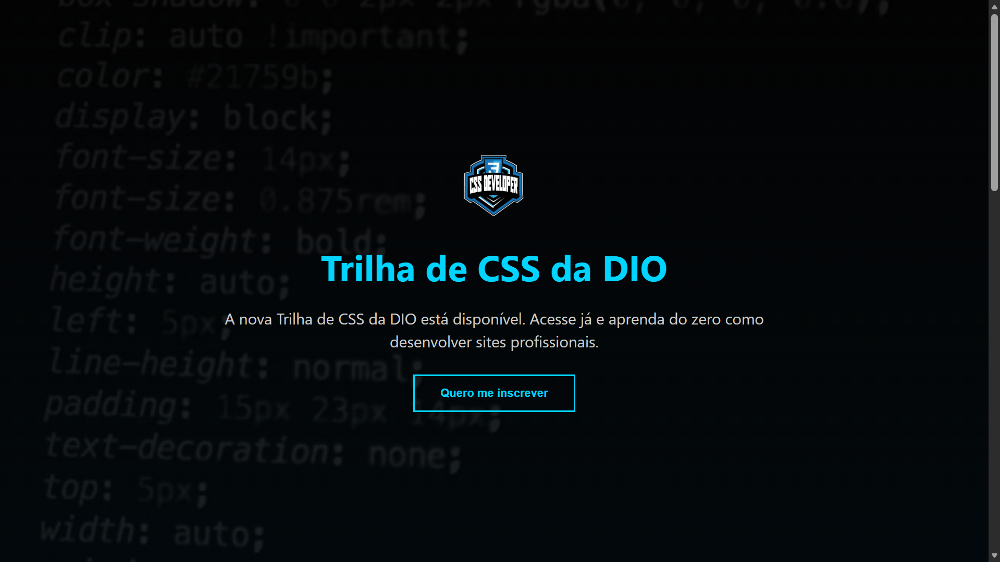

# 🚀 Landing Page - Bootcamp Santander 2025

Projeto desenvolvido como desafio do **Bootcamp Santander 2025 (Front-End)**, com o objetivo de criar uma landing page institucional utilizando **HTML e CSS**, aplicando conceitos de estrutura, layout e estilização moderna.

---

## 📸 Preview do Projeto

<p align="center">
  
</p>


---

## 🛠️ Tecnologias Utilizadas

* HTML5
* CSS3

---

## 🎯 Objetivo do Desafio

Criar uma página web para apresentação de um projeto, contendo:

* Estrutura organizada e semântica
* Estilização com CSS
* Layout moderno e responsivo
* Seções informativas e visuais

---

## 🔗 Referências

<p>
  <a href="https://github.com/digitalinnovationone/trilha-css-desafio-01" target="_blank">
    
  </a>
</p>

<p>
  <a href="https://www.figma.com/file/3PiokoJj9IhGDnNiWAJbz7/DIO---Desafio-01?node-id=0%3A1" target="_blank">
    
  </a>
</p>

---

## 🚀 Como Executar

```bash
# Clone o repositório
git clone https://github.com/seu-usuario/seu-repositorio.git

# Acesse a pasta
cd seu-repositorio

# Abra o index.html no navegador
```

---

## 📚 Aprendizados

Durante o desenvolvimento deste projeto, foram aplicados conceitos importantes como:

* Organização de layout com CSS
* Uso de cores e tipografia
* Estruturação de páginas web
* Criação de interfaces modernas

---

## 📌 Status do Projeto

✅ Concluído

---

## 👨‍💻 Autor

Desenvolvido por **Jose Luan Diniz**
